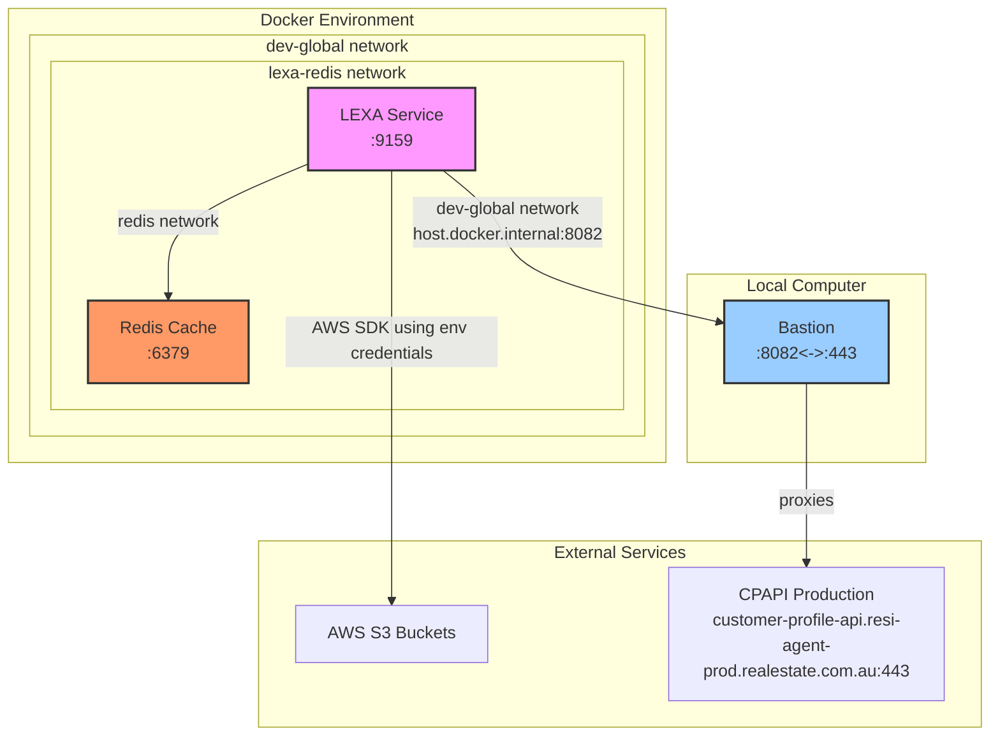
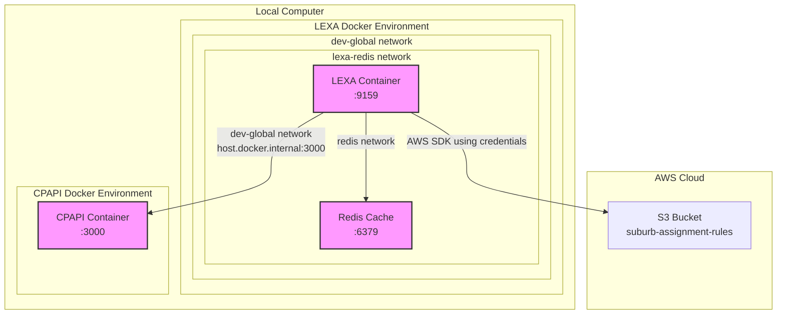

LEXA

```mermaid
graph TB
    subgraph Local Computer
        bastion[Bastion<br/>:8082<->:443]
    end

    subgraph Docker Environment
        subgraph dev-global network
            subgraph lexa-redis network
                lexa[LEXA Service<br/>:9159]
                redis[Redis Cache<br/>:6379]
            end
        end
    end

    subgraph External Services
        s3[AWS S3 Buckets]
        cpapi_prod[CPAPI Production<br/>customer-profile-api.resi-agent-prod.realestate.com.au:443]
    end

    %% Connections
    lexa --redis network--> redis
    lexa --dev-global network<br/>host.docker.internal:8082--> bastion
    bastion --proxies--> cpapi_prod
    lexa --AWS SDK using env credentials--> s3

    style lexa fill:#f9f,stroke:#333,stroke-width:2px
    style redis fill:#f96,stroke:#333,stroke-width:2px
    style bastion fill:#9cf,stroke:#333,stroke-width:2px
```

```mermaid
graph TB
    subgraph Local Computer
        subgraph LEXA Docker Environment
            subgraph dev-global network
                subgraph lexa-redis network
                    lexa[LEXA Container<br/>:9159]
                    redis[Redis Cache<br/>:6379]
                end
            end
        end

        subgraph CPAPI Docker Environment
            cpapi[CPAPI Container<br/>:3000]
        end
    end

    subgraph AWS Cloud
        s3[S3 Bucket<br/>suburb-assignment-rules]
    end

    %% Connections
    lexa --redis network--> redis
    lexa --dev-global network<br/>host.docker.internal:3000--> cpapi
    lexa --AWS SDK using credentials--> s3

    classDef container fill:#f9f,stroke:#333,stroke-width:2px
    classDef network fill:#f0f0f0,stroke:#666,stroke-width:1px
    class lexa,cpapi,redis container
```