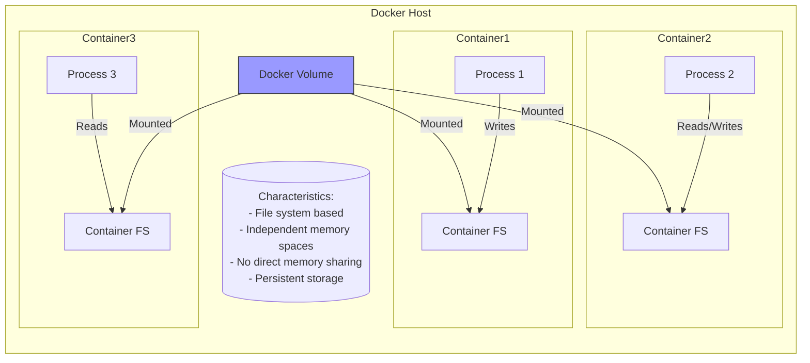

```mermaid
graph LR 
	subgraph Docker Host 
		subgraph Container1 
		P1[Process 1] -->|Writes| FS1[Container FS] 
	end 
	
	subgraph Container2 
		P2[Process 2] -->|Reads/Writes| FS2[Container FS] 
	end
	
	subgraph Container3 
		P3[Process 3] -->|Reads| FS3[Container FS] 
	end 
	
	V[Docker Volume] -->|Mounted| FS1 
	V -->|Mounted| FS2 
	V -->|Mounted| FS3 
	
	style V fill:#99f,stroke:#333 
	note2[("Characteristics:<br/>- File system based<br/>- Independent memory spaces<br/>- No direct memory sharing<br/>- Persistent storage")] 
end
```