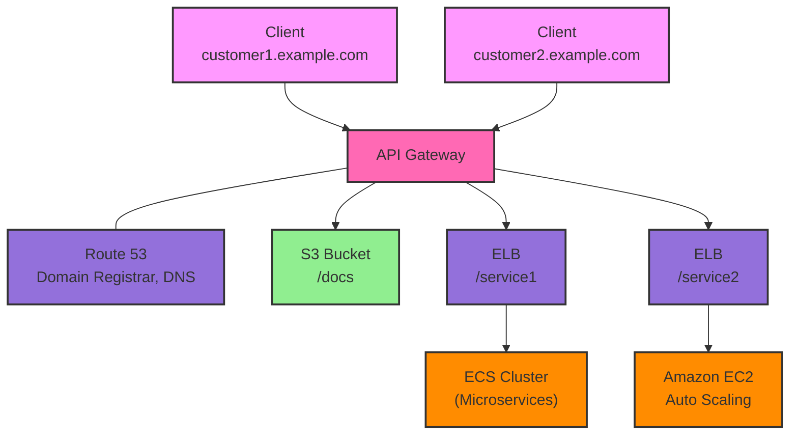

## Architecture

## API Types
- WebSocket API
	- Overview
		- WebSocket: two-way interactive communication between a user's browser and a server. Server can push information to the client. This enables stateful application use cases.
		- Use case: real-time applications such as chat applications, collaboration platforms, multiplayer games, and financial trading platforms.
		- Works with AWS services (Lambda, DynamoDB) or HTTP endpoints.
	- Message
		- URL: wss://[some-uniqueid].execute-api.[region].amazonaws.com/[stage-name]
		- Client to Server Messaging
			- Client => API Gateway WebSocket API => lambda => DynamoDB
		- Server to Client Messaging
			- Client => API Gateway WebSocket API => lambda => DynamoDB
			- Client <= Connection URL callback <= lambda <= DynamoDB
	- Operations: wss://abcdef.execute-api.us-west-1.amazonaws.com/dev/@connections/connectionId
		- POST: send a message from the server to the connected WS Client
		- GET: get the latest connection status of the connected WS Client
		- DELETE: disconnect the connected client from the WS Client

	- Routing: incoming JSON messages are routed to different backend
		- no routes => $default
		- route selection expression => select the field on JSON to route them
		- result is evaluated against the route keys available in your API Gateway
		- route is then connected to the backend you've setup through API Gateway
- HTTP API
- REST API

| Authorizers                             | HTTP API | REST API |
| --------------------------------------- | -------- | -------- |
| AWS Lambda                              | ✓        | ✓        |
| IAM                                     | ✓        | ✓        |
| Resource Policies                       |          | ✓        |
| Amazon Cognito                          | ✓*       | ✓        |
| Native OpenID Connect / OAuth 2.0 / JWT | ✓        |          |

## Integration Types
- MOCK
	- API Gateway returns a response without sending the request to the backend
- Lambda function
	- AWS lambda + API Gateway: No infrastructure to manage
- AWS_PROXY
	- Incoming request is the input to lambda
- HTTP
- HTTP_PROXY
- AWS Services
	- Kinesis Data Streams

## Mapping Templates (AWS & HTTP Integration)
- Used to modify requests/response
- Rename/modify query string parameters
- Modify body content
- Add headers
- Example: JSON to XML with SOAP

## Endpoint Types
### Edge-optimized

### Regional

### Private

## Security

### User Authentication through
- IAM Roles
- Cognito
- Custom Authorizer
### Custom Domain Name HTTPS

### Deployment Stages
- Need to make a `deployment` for the changes to be in effect.
- Stage variables
	- like env vars for API Gateway
	- used for often changing config values
	- used in: lambda function arn, HTTP endpoint, parameter mapping templates
	- use cases: 
		- config HTTP endpoints your stages talk to
		- pass configuration params to lambda through mapping templates
	- passed to context object in AWS lambda

- Canary deployments
	- Choose the % of traffic the canary channel receives

- A **fully managed service** to create, publish, maintain, monitor, and secure APIs at any scale. 
- A front door for applications to access data, business logic, or functionality hosted on backend services, such as Lambda functions, EC2 instances, or HTTP endpoints. 
- provides features like API creation, versioning, deployment, security, monitoring, and **throttling** => throttles requests to your API using the token bucket algorithm, where a token counts for a request. Specifically, API Gateway sets a limit on a steady-state rate and a burst of request submissions against all APIs in your account. In the token bucket algorithm, the burst is the maximum bucket size. 
	- tokens in this model help to smooth out the handling of API requests during both normal and high-traffic conditions, ensuring a more reliable and consistent service experience.

- **Edge-Optimized(default): For global clients**
	- Requests are routed through the CloudFront Edge locations (improves latency)
	- The API Gateway still lives in only one region
- Regional
	- For clients within the same region
	- Could manually combine with CloudFront (more control over the caching strategies and the distribution)
- Private
	- Can only be accessed from your VPC using an interface VPC endpoint (ENI)
	- Use a resource policy to define access

Key features of API Gateway include:
- **API Creation and Management**: You can define APIs using API Gateway's RESTful interface or WebSocket APIs for real-time communication.
- **Integration with Backend Services**: API Gateway can integrate with various backend services, including Lambda functions, EC2 instances, HTTP endpoints, and other AWS services.
- **Security**: API Gateway supports authentication and authorization mechanisms such as AWS IAM, OAuth 2.0, and custom authorizers to control access to your APIs.
- **Monitoring and Logging**: API Gateway provides detailed monitoring metrics, logging, and tracing capabilities to help you troubleshoot and optimize your APIs.

API Gateway is commonly used for building RESTful APIs, GraphQL APIs, WebSocket APIs, and serverless applications, allowing developers to expose their backend services securely and efficiently to external clients.

## Open API spec
- Define REST APIs
- RequestValidation: basic validation of an API request before proceeding with the integration request
- Setup request validation by importing OpenAPI definitions file

## Caching API Response

## Logging and Tracing
- CloudWatch
	- logs
	- metrics
		- CacheHitCount
		- CacheMissCount
		- Integration Latency
		- Latency: Integration latency + other API Gateway overhead
	- errors: 4XXError, 5XXError
- X-Ray

## Throttling
- Account Limit

## CORS
- enabled when receive API calls from another domain

## Authentication and Authorization
- IAM Permissions
	- Great for users / roles already within your AWS account, + resource policy for cross account
	- Handle authentication + authorization
	- Leverages Signature v4
- Cognito User Pools
	- 
- Lambda Authorizer: request parameter-based(header, query string, stage var)
	- Great for 3rd party tokens
	- Very flexible in terms of what IAM policy is returned
	- Handle Authentication verification + Authorization in the Lambda function
	- Pay per Lambda invocation, results are cached
