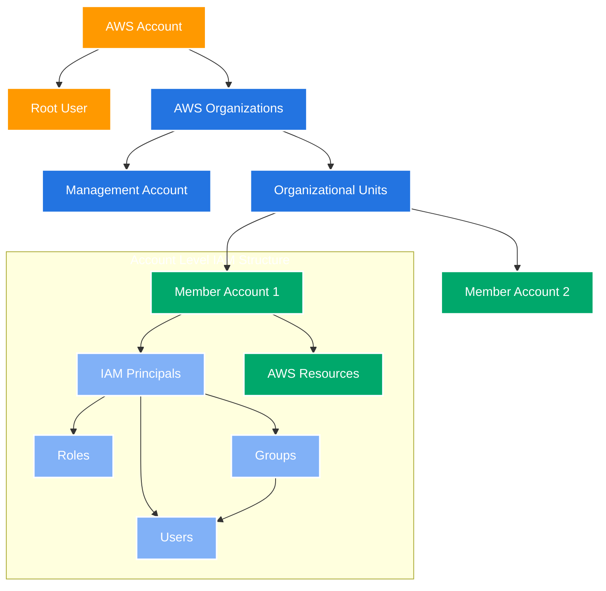
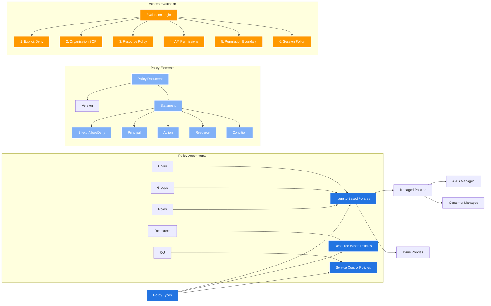

Control access to AWS services and resources.

## IAM Core Hierarchy

- **Organization:** global service to provide a comprehensive view and management across all AWS accounts. 
	- Advantages
		- **Multi Account** vs One Account Multi VPC
		- Use **tagging standards** for billing purposes  
		- Enable **CloudTrail on all accounts**, send logs to central S3 account
		- Send CloudWatch Logs to central logging account  
		- Establish Cross Account Roles for Admin purposes
	- Security: **Service Control Policies (SCP)**, policies that **offer central control over the maximum available permissions for all accounts in organization**, allowing permission management across the organization. 
		- SCPs can whitelist or blacklist access to specific AWS services and actions for all accounts under the organizational unit. **This is a scalable solution as it maintain permissions from a single point at the organization level, and it automatically applies to all accounts under it.**
		- IAM policies applied to OU or Accounts to restrict Users and Roles
		- They do not apply to the management account (full admin power)
		- Must have an explicit allow (does not allow anything by default – like IAM)
- **Management Account** (formerly master account) controls the organization. 
	- Each account is a root user and can be part of the organization, operating independently and can have its own resources and IAM users/groups/roles. **AWS recommends that user account credentials should not be shared between users.**
- **Organizational Units** (OU: logical groupings within the organization) help group and manage multiple accounts
- **Member accounts exist within OUs**
	- IAM Principals (Users, Groups, Roles) exist within each account
	- Resources are created and managed within accounts
- **Groups:** contains users only, typically used for managing permissions for multiple users
- **Users:** mapped to a physical user with a password for AWS console.
	- Meant for individual human users or applications. 
	- Users are people within the organization, and can be grouped. 
	- Users don’t have to belong to a group, and user can belong to multiple groups
- **Role:** 
	- recommended approach for granting permissions to AWS resources like EC2 instances, S3 buckets, Kinesis stream, Systems Manager Run Command, ECS task...
	- If assume a role (user, application or service), you give up the original permissions.
- **Policies:** JSON document that outlines permissions for users or groups.
	- Define permissions within AWS environments.
	- Allow for granular access control, centralized management of permissions, and flexibility in defining security policies.

- Permission boundaries
	- IAM permission boundaries complement IAM users or roles by setting a limit on the maximum permissions that can be assigned to them.

- Identity Center(successor to AWS single sign-on): Fine grained Permissions and Assignments
	- One login (single sign-on) for all your  
		- AWS accounts in AWS Organizations  
		- Business cloud applications (e.g., Salesforce, Box, Microsoft 365, ...) 
		- SAML2.0-enabled applications  
		- EC2 Windows Instances

- Control Tower
	- Easy way to set up and govern a secure and compliant multi-account AWS environment based on best practices

## AWS Policies and Permissions

- **Policy Types**:
    - Identity-Based Policies: Attached to IAM principals
    - Resource-Based Policies: Attached to resources
    - Service Control Policies: Applied at organization level
- **Policy Management**:
    - Managed Policies: Both AWS-managed and Customer-managed
    - Inline Policies: Embedded directly in a principal
- **Policy Elements**:
    - Shows the structure of policy documents
    - Includes Effect, Principal, Action, Resource, and Condition
- **Access Evaluation**:
    - Shows the order of evaluation for access decisions
    - Demonstrates how different policy types interact
- **Condition keys**
	- `aws:PrincipalOrgID`: check if the requester is a member of an organization.
	- `aws:PrincipalOrgPaths`: check if the requester's account in located within the OU path in the organization.
	- `aws:PrincipalTag`: check tags attached to the principal making the request.

## IAM Authentication & Security Features

```mermaid
graph TD
    %% Authentication Methods
    Auth[Authentication Methods] --> LTP[Long-term Credentials]
    Auth --> STC[Short-term Credentials]
    
    %% Long-term Credentials
    LTP --> PWD[Password]
    LTP --> AK[Access Keys]
    
    %% Short-term Credentials
    STC --> STS[AWS STS]
    STS --> AssumeRole[AssumeRole]
    STS --> AssumeRoleWithSAML[AssumeRole with SAML]
    STS --> AssumeRoleWithWebIdentity[AssumeRole with Web Identity]
    
    %% Federation
    Federation[Identity Federation] --> SAML[SAML 2.0 Providers]
    Federation --> WebID[Web Identity Providers]
    Federation --> SSO[AWS SSO]
    WebID --> Cognito[Amazon Cognito]
    WebID --> Social[Social Identity Providers]
    Social --> Google[Google]
    Social --> Facebook[Facebook]
    
    %% Security Features
    Security[Security Features] --> MFA[Multi-Factor Authentication]
    Security --> RotationReq[Rotation Requirements]
    Security --> PassPolicy[Password Policy]
    
    MFA --> VirtMFA[Virtual MFA]
    MFA --> U2F[U2F Security Keys]
    MFA --> HardMFA[Hardware MFA Tokens]
    
    %% Access Analysis
    Analysis[Access Analysis] --> CloudTrail[AWS CloudTrail]
    Analysis --> IAMAccAnalyzer[IAM Access Analyzer]
    Analysis --> CredReport[Credential Reports]
    Analysis --> AccActivity[Account Activity]
    
    %% Styling
    classDef primary fill:#2374e1,stroke:#fff,stroke-width:2px,color:#fff
    classDef secondary fill:#ff9900,stroke:#fff,stroke-width:2px,color:#fff
    classDef feature fill:#81b1f7,stroke:#fff,stroke-width:2px,color:#fff
    
    class Auth,Federation,Security primary
    class STS,MFA,Analysis secondary
    class CloudTrail,IAMAccAnalyzer,PassPolicy feature
```

- **Authentication Methods**:
	- Long-term Credentials: Passwords and Access Keys
    - Short-term Credentials: Generated via AWS STS
- **Federation Options**:
    - SAML 2.0 for enterprise integration
    - Web Identity providers (including social providers)
    - AWS SSO for centralized access management
- **Security Features**:
    - Multiple MFA options (Virtual, U2F, Hardware)
    - Credential rotation requirements
    - Password policies
- **Access Analysis**:
    - Monitoring tools like CloudTrail
    - Analysis tools like IAM Access Analyzer
    - Reporting capabilities

## IAM Guidelines & Best Practices
- Don't use the root account except for AWS account setup

## Shared Responsibility Model for IAM
### AWS
- Infrastructure (global network security)
- Configuration and vulnerability analysis
- Compliance validation
### User
- Users, Groups, Roles, Policies management and monitoring
- Enable MFA on all accounts
- Rotate all the keys often
- Use IAM tools to apply appropriate permissions
- Analyze access patterns & review permissions

## Audit: IAM Security Tools
- Credentials Report
- Access Advisor