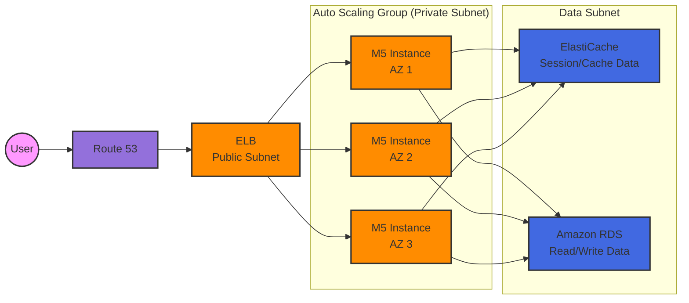
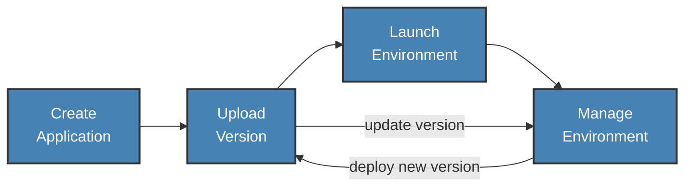
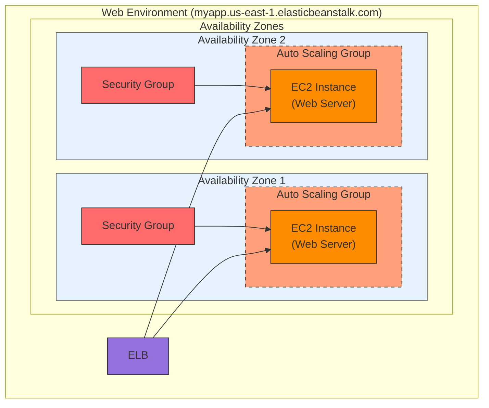
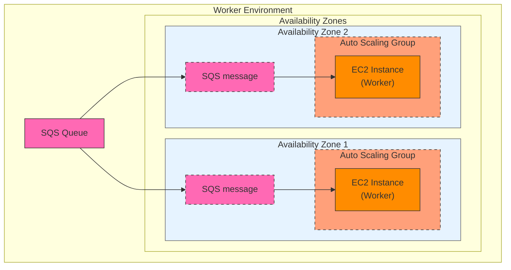
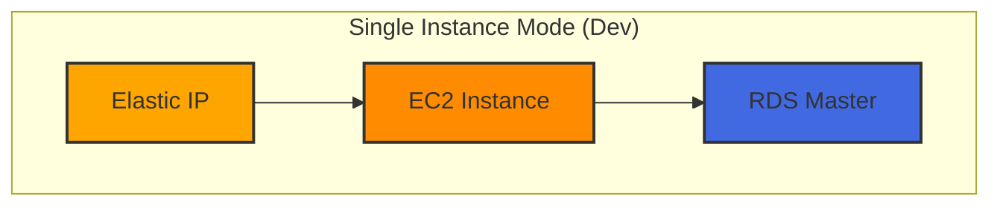
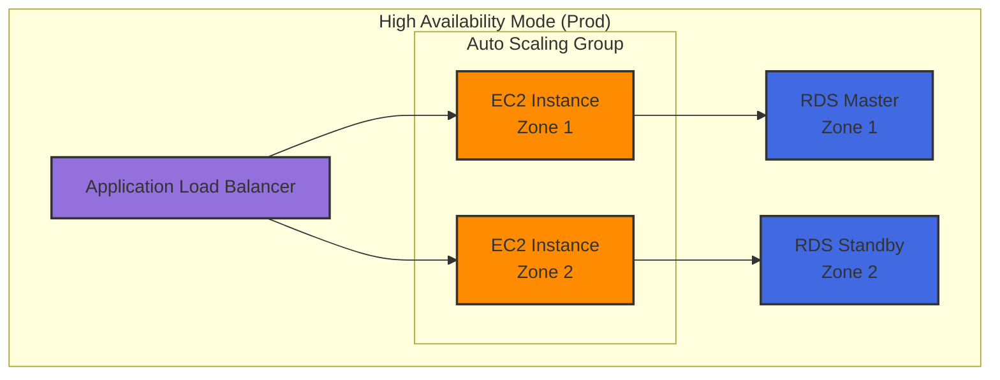

Deploy and manage applications in the cloud without worrying about the infrastructure.

## Typical Architecture: Web App 3-tier

**Developer problems on AWS**
- Managing infrastructure
- Deploying Code
- Configuring all the databases, load balancers, etc
- Scaling concerns
- Most web apps have the same architecture (ALB + ASG)
- All the developers want is for their code to run!
- Possibly, consistently across different applications and environments

## Overview of Beanstalk
- Elastic Beanstalk is a developer centric view of deploying an application on AWS
- It uses all the component’s we’ve seen before: EC2, ASG, ELB, RDS, …
- Managed service, and devs just need to manage the application code
- Automatically handles capacity provisioning, load balancing, scaling, application health monitoring, instance configuration, …
- We still have full control over the configuration
- Beanstalk is free but you pay for the underlying instances

## Components
- Application: collection of Elastic Beanstalk components (env, versions, configurations, …)
- Application Version: an iteration of your application code
- Environment
	- Collection of AWS resources running an app version (only one app version at a time)
	- Tiers: Web Server Environment Tier & Worker Environment Tier
	- Can create multiple environments (dev, test, prod, …)

## Supported Platforms
- Go, Java SE, Java with Tomcat, .NET Core on Linux, .NET on Windows Server, Node.js, PHP, Python, Ruby, Packer Builder, Single Container Docker, Multi-container Docker, Preconfigured Docker

## Web Server Tier vs. Worker Tier
- Web Server Tier: Client -> ELB -> Web Servers (responds immediately)
	- Handles incoming HTTP(S) requests directly from clients
	- Typically runs web applications that need to respond immediately to user requests
	- Automatically includes an ELB and Auto Scaling Group
	- Use cases:
		- Web fronted serving pages
		- REST APIs responding to client requests
		- User Interface components

- Worker Tier: Web Server -> SQS Queue -> Worker (processes in background)
	- Scale based on the number of SQS messages
	- Can push messages to SQS queue from another Web Server Tier
	- Handles background processing tasks that can take a long time
	- Instead of HTTP requests, it processes messages from an SQS queue
	- Designed for asynchronous workloads
	- Examples:
	    - Video encoding
	    - Image processing
	    - Email sending
	    - Report generation
	    - Data processing
	    - Long-running calculations

## Deployment Modes
- Single Instance - great for dev

- High Availability with Load Balancer - great for prod

- Why These Modes?
	1. Cost vs Reliability Trade-off:
	    - Dev envs don't need high availability, so single instance is more cost-effective
	    - Prod needs reliability, justifying the higher cost of HA setup
	2. Different Requirements:
	    - Development: Quick iteration, easy debugging
	    - Production: Stability, scalability, redundancy
	3. Resource Optimization:
	    - Dev can use smaller instances
	    - Production needs capacity for real user loads
	4. Risk Management:
		- Dev can tolerate some downtime
	    - Production requires minimal downtime and data loss protection

## Options for Updates
- All at once (deploy all in one go) – fastest, but instances aren’t available to serve traffic for a bit (downtime)
- Rolling: update a few instances at a time (bucket), and then move onto the next bucket once the first bucket is healthy
- Rolling with additional batches: like rolling, but spins up new instances to move the batch (so that the old application is still available)
- Immutable: spins up new instances in a new ASG, deploys version to these instances, and then swaps all the instances when everything is healthy
- Blue Green: create a new environment and switch over when ready
- Traffic Splitting: canary testing – send a small % of traffic to new deployment

## Deployment Process
- Describe dependencies
- Package code as zip, and describe dependencies
	- Python: requirements.txt
	- Node.js: package.json
- Console: upload zip file (creates new app version), and then deploy
- CLI: create new app version using CLI (uploads zip), and then deploy
- Elastic Beanstalk will deploy the zip on each EC2 instance, resolve dependencies and start the application

## Lifecycle policy
- Elastic Beanstalk can store at most 1000 application versions
- If you don’t remove old versions, you won’t be able to deploy anymore
- To phase out old application versions, use a lifecycle policy
	- Based on time (old versions are removed)
	- Based on space (when you have too many versions)
- Versions that are currently used won’t be deleted
- Option not to delete the source bundle in S3 to prevent data loss

## Extensions
- A zip file containing our code must be deployed to Elastic Beanstalk
- All the parameters set in the UI can be configured with code using files
- Requirements:
	- in the .ebextensions/ directory in the root of source code
	- YAML / JSON format
	- .config extensions (example: logging.config)
	- Able to modify some default settings using: option_settings
	- Ability to add resources such as RDS, ElastiCache, DynamoDB, etc…
- Resources managed by .ebextensions get deleted if the environment goes away

## Under the hood
- Under the hood, Elastic Beanstalk relies on CloudFormation
- CloudFormation is used to provision other AWS services
- Use case: you can define CloudFormation resources in your .ebextensions to provision ElastiCache, an S3 bucket, anything you want!